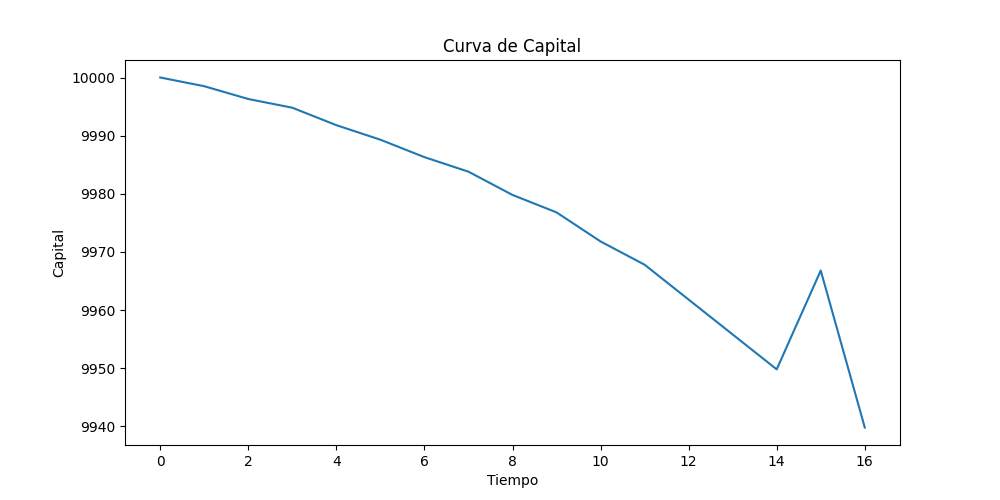
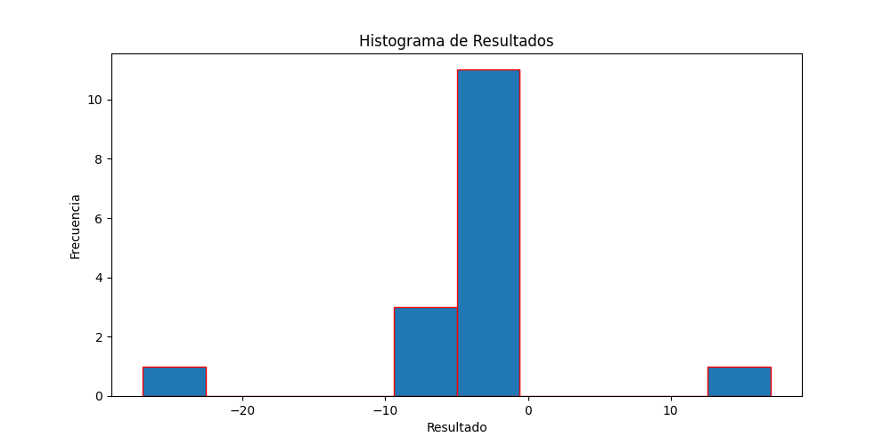
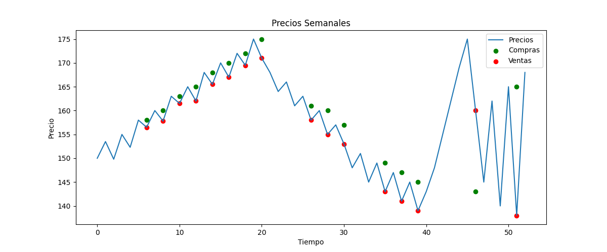
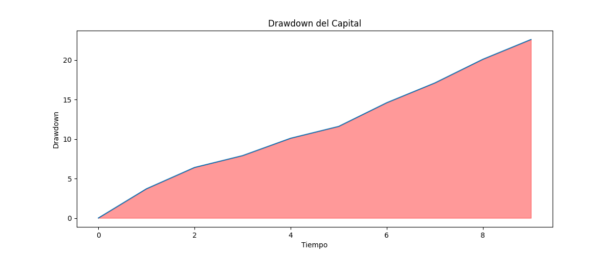

# 📊 Trading Backtesting Engine v1

## 🧠 ¿Qué problema resuelve?

Antes de arriesgar capital real, un trader necesita saber si su estrategia funciona.
Este sistema permite simular cualquier estrategia de trading sobre datos históricos reales o locales,
medir su rendimiento con métricas profesionales, visualizar los resultados y optimizar los parámetros automáticamente,
todo sin exponer dinero real.

Está orientado a quienes quieren entender cómo se evalúa una estrategia de forma sistemática,
como primer paso hacia el trading algorítmico profesional.

---

## 🎯 Contexto

Este proyecto nació como ejercicio práctico de Programación Orientada a Objetos aplicado a un dominio real:
el análisis cuantitativo de estrategias de trading.

El objetivo no fue solo escribir código que funcione, sino diseñar un sistema con arquitectura limpia,
responsabilidades separadas y componentes reutilizables, simulando cómo se estructura software en un entorno profesional.

Cada módulo aplica principios SOLID, en especial el Principio de Responsabilidad Única:
ningún archivo hace más de una cosa.

En su segunda fase, el sistema evolucionó hacia una **plataforma interactiva con Streamlit**,
agregando una capa de presentación completa sin modificar ningún archivo del núcleo original.

---

## ⚙️ ¿Cómo funciona?

**Modo consola:**

```
Datos históricos (CSV local o Yahoo Finance)
            ↓
    DataLoader / YahooFinanceFetcher → carga y estructura los datos
            ↓
    StrategyFactory → selecciona la estrategia configurada
            ↓
    Estrategia → analiza cada día y genera una señal (comprar / vender / None)
            ↓
    Backtester → simula las operaciones y lleva el balance
            ↓
    Metrics → calcula métricas de rendimiento
            ↓
    Visualizacion → genera 4 gráficos en output/charts/
            ↓
    Reporte → presenta los resultados en consola
            ↓
    Optimizer → prueba todas las combinaciones de parámetros y guarda el ranking
```

**Modo Streamlit:**

```
Usuario configura ticker, estrategia y parámetros en el sidebar
            ↓
    StrategyConfig → provee los parámetros configurables de cada estrategia
            ↓
    BacktestRunner → orquesta la descarga de datos, crea la estrategia y ejecuta el backtest
            ↓
    Charts → genera gráficos interactivos con Plotly
            ↓
    Streamlit → renderiza métricas, gráficos e historial en el navegador
```

---

## 📈 Estrategias disponibles

| Estrategia         | Clave          | Descripción                                                         |
| ------------------ | -------------- | ------------------------------------------------------------------- |
| Media Móvil Simple | `MediaMovil`   | Compra si el precio sube respecto al día anterior, vende si baja    |
| Breakout           | `Breakout`     | Compra si el precio supera un umbral fijo, vende si está por debajo |
| SMA Crossover      | `SmaCrossover` | Compra cuando la SMA rápida cruza por encima de la SMA lenta        |
| RSI                | `Rsi`          | Compra en zona de sobrevendido (<30), vende en sobrecomprado (>70)  |
| Bollinger Breakout | `Bollinger`    | Opera cuando el precio rompe las bandas de Bollinger                |
| MACD Crossover     | `MACD`         | Compra cuando la MACD line cruza por encima de la signal line       |

**Modo consola** — modifica `ESTRATEGIA` en `config.py`:

```python
ESTRATEGIA = "SmaCrossover"  # Cambia por cualquier clave de la tabla
```

**Modo Streamlit** — selecciona la estrategia directamente desde el sidebar de la interfaz.

---

## 📊 Métricas calculadas

El sistema calcula automáticamente las siguientes métricas tras cada simulación:

| Métrica                     | Descripción                                                 |
| --------------------------- | ----------------------------------------------------------- |
| Win Rate                    | Porcentaje de operaciones ganadoras                         |
| Retorno porcentual          | Ganancia o pérdida total respecto al capital inicial        |
| Mejor / Peor trade          | Operación más rentable y más costosa                        |
| Ganancia / Pérdida promedio | Promedio de operaciones ganadoras y perdedoras por separado |
| Profit Factor               | Ratio entre ganancias totales y pérdidas totales            |
| Max Drawdown                | Mayor caída consecutiva del balance desde un punto alto     |
| Expectancy                  | Ganancia o pérdida esperada promedio por operación          |

---

## 📉 Visualizaciones

**Modo consola** — genera 4 gráficos PNG en `output/charts/`:

**Curva de Capital** — Evolución del balance a lo largo de las operaciones.


**Histograma de Resultados** — Distribución de ganancias y pérdidas por operación.


**Precios y Señales** — Línea de precios con puntos de compra y venta marcados.


**Drawdown** — Área de caída del balance desde el punto más alto.


**Modo Streamlit** — los mismos 4 gráficos se muestran de forma interactiva con Plotly
directamente en el navegador, con zoom, hover y tooltips.

---

## 🔧 Optimización de parámetros

El `Optimizer` prueba automáticamente todas las combinaciones posibles de parámetros (Grid Search)
y guarda el ranking en `output/optimization_results.csv`.

**Modo consola** — ejemplo de uso en `main.py`:

```python
optimizer = Optimizer(
    estrategia_clase=EstrategiaSmaCrossover,
    datos=datos,
    balance_inicial=config.BALANCE_INICIAL,
    parametros={
        "periodo_corto": [2, 3, 5],
        "periodo_largo": [4, 5, 10]
    }
)
optimizer.optimizar()
```

**Modo Streamlit** — desde la página de Optimización el usuario define mínimo, máximo y paso
por cada parámetro, y el sistema ejecuta el grid search mostrando el ranking como tabla interactiva.

---

## 🧱 Arquitectura del sistema

El sistema aplica el **Principio de Responsabilidad Única** en cada módulo.

### Núcleo (`src/`)

| Módulo                   | Responsabilidad                                                             |
| ------------------------ | --------------------------------------------------------------------------- |
| `config.py`              | Centraliza toda la configuración. Ningún archivo tiene valores hardcodeados |
| `data_loader.py`         | Carga y valida el CSV local. Devuelve lista de diccionarios                 |
| `data_fetcher.py`        | Descarga datos reales desde Yahoo Finance con el mismo formato              |
| `strategies/__init__.py` | Define la clase abstracta `Estrategia` con el contrato obligatorio          |
| `strategies/*.py`        | Cada estrategia en su propio archivo. Solo analiza precios y emite señales  |
| `strategy_factory.py`    | Decide qué estrategia instanciar según la configuración (modo consola)      |
| `backtester.py`          | Simula las operaciones y registra el historial                              |
| `metrics.py`             | Calcula todas las métricas de rendimiento. No imprime nada                  |
| `reporte.py`             | Presenta los resultados en consola. No calcula nada                         |
| `visualizacion.py`       | Genera los 4 gráficos PNG. No calcula métricas ni imprime texto             |
| `optimizer.py`           | Prueba combinaciones de parámetros y guarda el ranking en CSV               |
| `decoradores.py`         | Herramientas transversales: logging y medición de tiempo                    |

### Capa de presentación (`app/`)

| Módulo               | Responsabilidad                                                                      |
| -------------------- | ------------------------------------------------------------------------------------ |
| `strategy_config.py` | Catálogo de parámetros configurables por estrategia (min, max, default, tipo, label) |
| `runner.py`          | Orquesta la ejecución completa del backtest y devuelve un diccionario de resultados  |
| `charts.py`          | Convierte los resultados del runner en figuras interactivas de Plotly                |

### Páginas Streamlit (`pages/`)

| Página              | Responsabilidad                                                                 |
| ------------------- | ------------------------------------------------------------------------------- |
| `1_backtest.py`     | Configuración interactiva, ejecución del backtest y visualización de resultados |
| `2_optimizacion.py` | Grid search interactivo con ranking de combinaciones de parámetros              |
| `3_historial.py`    | Tabla navegable del historial completo de operaciones                           |

### Decisiones de diseño

**Clases abstractas en `Estrategia`**
Se usó `ABC` para definir un contrato obligatorio. Cualquier estrategia nueva debe implementar `generar_senal()`,
garantizando que el sistema funcione sin importar qué estrategia se use.

**Inyección de dependencia en `Backtester`**
El `Backtester` no crea su estrategia, la recibe como parámetro.
Esto permite cambiar de estrategia sin tocar el motor de simulación.

**Decoradores como herramientas transversales**
En lugar de repetir lógica de logging y medición en cada función,
se encapsuló en decoradores reutilizables que se aplican con una sola línea.

**Factory Pattern en `strategy_factory.py`**
Ningún otro archivo del núcleo decide qué estrategia usar en modo consola.
Toda esa lógica vive en un solo lugar.

**Capa de presentación desacoplada**
`app/` y `pages/` conocen el núcleo pero el núcleo no sabe que Streamlit existe.
Esto permite usar el sistema desde consola o desde la interfaz web sin modificar ningún archivo compartido.

**`session_state` para persistencia entre páginas**
El resultado del backtest se guarda en `st.session_state` desde `1_backtest.py`
para que `3_historial.py` pueda acceder a él sin volver a ejecutar el backtest.

---

## 🗂️ Estructura del proyecto

```
Backtesting/
├── app/                          ← Capa de presentación (nueva)
│   ├── __init__.py
│   ├── strategy_config.py        ← Catálogo de parámetros por estrategia
│   ├── runner.py                 ← Orquestador entre UI y núcleo
│   └── charts.py                 ← Gráficos interactivos con Plotly
├── data/
│   └── precios.csv
├── pages/                        ← Páginas de Streamlit (nueva)
│   ├── 1_backtest.py             ← Configuración y ejecución interactiva
│   ├── 2_optimizacion.py         ← Grid search con ranking de resultados
│   └── 3_historial.py            ← Tabla de historial de operaciones
├── src/                          ← Núcleo del sistema (sin modificaciones)
│   ├── strategies/
│   │   ├── __init__.py           ← Clase abstracta Estrategia
│   │   ├── media_movil.py
│   │   ├── breakout.py
│   │   ├── sma_crossover.py
│   │   ├── rsi.py
│   │   ├── bollinger.py
│   │   └── macd.py
│   ├── __init__.py
│   ├── data_loader.py
│   ├── data_fetcher.py
│   ├── backtester.py
│   ├── reporte.py
│   ├── decoradores.py
│   ├── strategy_factory.py
│   ├── metrics.py
│   ├── visualizacion.py
│   └── optimizer.py
├── tests/
│   ├── test_loader.py
│   ├── test_backtester.py
│   └── test_metrics.py
├── output/
│   └── charts/
│       ├── curva_capital.png
│       ├── histograma_resultados.png
│       ├── precios_semanales.png
│       └── drowdown.png
├── conftest.py
├── config.py
├── main.py
├── streamlit_app.py              ← Punto de entrada de la interfaz web (nuevo)
└── README.md
```

---

## 🛠️ Tecnologías utilizadas

| Tecnología                                               | Uso                                       |
| -------------------------------------------------------- | ----------------------------------------- |
| Python 3.14                                              | Lenguaje principal                        |
| `streamlit`                                              | Interfaz web interactiva                  |
| `plotly`                                                 | Gráficos interactivos en la interfaz web  |
| `pandas`                                                 | Conversión de historial a tabla navegable |
| `matplotlib`                                             | Generación de gráficos PNG (modo consola) |
| `yfinance`                                               | Descarga de datos históricos reales       |
| `pytest`                                                 | Testing unitario                          |
| `csv`, `itertools`, `statistics`, `argparse`, `tempfile` | Librería estándar de Python               |

---

## ▶️ Cómo ejecutarlo

**Interfaz web con Streamlit (recomendado):**

```bash
streamlit run Backtesting/streamlit_app.py
```

O desde dentro de la carpeta `Backtesting/`:

```bash
streamlit run streamlit_app.py
```

Esto abre la aplicación en el navegador en `http://localhost:8501`.
Desde ahí puedes configurar ticker, estrategia, parámetros y período directamente desde la UI.

---

**Modo consola con datos locales (CSV):**

```bash
python Backtesting/main.py
```

**Modo consola con datos reales de Yahoo Finance:**

```bash
python Backtesting/main.py --ticker AAPL
python Backtesting/main.py --ticker BTC-USD
python Backtesting/main.py --ticker MSFT
```

**Ejecutar los tests:**

```bash
pytest Backtesting/tests/ -v
```

**Instalar dependencias:**

```bash
pip install matplotlib yfinance pytest streamlit plotly pandas
```

---

## 📦 Ejemplo de salida (consola)

```
La funcion tardó 0.0001 segundos
La operacion comenzo
Historial de operaciones
{'fecha': '2026-02-05', 'precio_compra': 269.76, 'precio_venta': 275.65, 'resultado': 5.9}
{'fecha': '2026-02-20', 'precio_compra': 264.35, 'precio_venta': 264.58, 'resultado': 0.2}
...
Balance inicial: 10000
Balance final: 10001.11
Ganancia/Perdida: 1.11
Numero de operaciones realizadas: 10
Numero de operaciones ganadas: 6
Win rate: 60.00%
--- Metricas Avanzadas ---
mejor_trade: 6.6
peor_trade: -6.2
ganancia_promedio: 3.02
perdida_promedio: 4.27
retorno_porcentual: 0.01
profit_factor: 1.06
max_drawdown: 15.4
expectancy: 0.1
La operacion finalizo
```

---

## 🚀 Próximos pasos

- Conectar con APIs adicionales: Binance, Alpha Vantage
- Implementar EMA real en lugar de SMA aproximada para MACD
- Agregar ratio de Sharpe como métrica de riesgo ajustado
- Backtesting con múltiples activos simultáneos
- Exportar reporte completo a PDF desde la interfaz Streamlit
- Agregar autenticación para despliegue en Streamlit Cloud

---

## 👤 Autor

**Abiezer Peguero**

Enfocado en el desarrollo de sistemas aplicados al trading algorítmico y la ciencia de datos.
Este proyecto es parte de un camino hacia la construcción de herramientas que conecten
ingeniería de software con análisis financiero cuantitativo.

Para documentación técnica interna ver [ARCHITECTURE.md](ARCHITECTURE.md)

[](https://github.com/AbiezerPeguero/Sistema-de-Trading)
